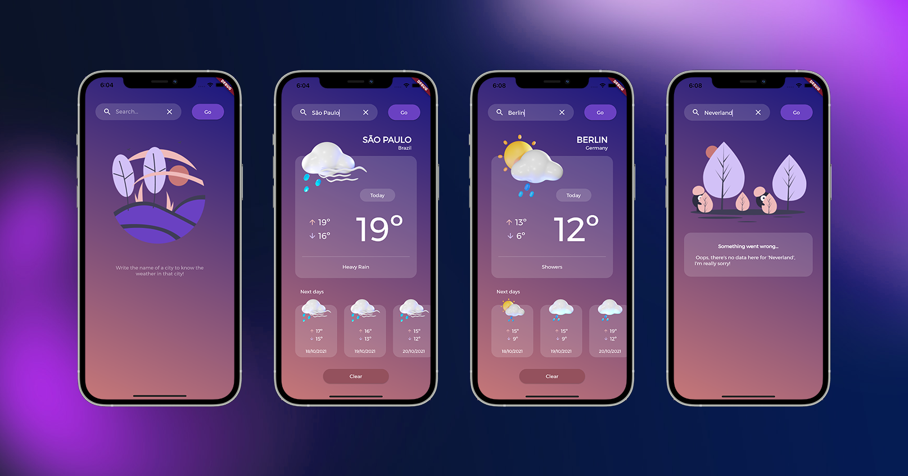

# Weather Today: A weather app built with mobX and the MetaWeather API

This project is my first one build in flutter, and I was inspired by the Flutter Modular architecture to structure the folders:



The project uses the [MetaWeather API](https://www.metaweather.com/api/) to fetch a list of cities and their respective weather data such as minimum and maximum temperature, weather state, date, wind speed and direction.

### Installing the project

You can install this app on your android phone downloading the apk file `weather-today.apk` in this repository.

## App Overview

The application is pretty simple, it is a one page application with a **search bar** and it has mainly three states: the first screen when the user is not searching anything, the main screen that shows the user data fetched from the API, and an error screen in case something wrong happens.

## App Structure

This app was made as an extension of the terminal app built in the Dart complete course from Andrea Bizzotto on Udemy, but as I transformed it into a flutter app, I felt the need of a project architecture. For that reason I chose to sctucture my project based on the Flutter Modular architecture, because I find it easy to understand and also scalable.

The project folders are structured like this:

```
/lib
  /models
  /modules
    /search
      /repositories
      /results
  /theme

```

Inside `models` you can find the classes created to best represent data from the API.

`Modules`are the pages inside the app and since it is a unique page application, we only have the search module. Inside it we have the `repository`, responsible for fetching data from the API.

## Packages used in this project


- [x] [MobX](https://pub.dev/packages/mobx) 
- [x] [HTTP](https://pub.dev/packages/http) 
- [x] [Google Fonts](https://pub.dev/packages/google_fonts) 


## Credits

This project was made inspired by the app build on the Dart complete course by [Andrea Bizzotto](https://github.com/bizz84).
I have to thank the girls from Flutter Girls who always support and help me in every issue I bump into, you are the best!

## [LICENSE: MIT](LICENSE.md)